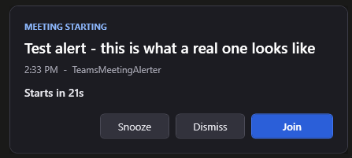

# TeamsMeetingAlerter

NOTICE: This is 100% pure AI vibe slop. It works though.

Alerts you 30 seconds before a Teams meeting starts, because Teams often doesn't.

An always-on-top window with a **Join** button appears in the bottom-right corner. No sound.
While a fullscreen app is in the foreground it holds back and stays out of the way, then
raises itself once you're back.



## Setup

One time, from this folder:

```powershell
.\Install.ps1
```

It signs you in (device code in a browser — no app registration needed, it uses
Microsoft's own public Graph PowerShell client) and registers a per-user scheduled
task that starts at logon. No admin rights required.

## Commands

| Command | What it does |
| --- | --- |
| `.\Watch.ps1 -Status` | Quiet-mode state, task/watcher state, next meetings |
| `.\Watch.ps1 -TestAlert` | Show a sample alert now |
| `.\Watch.ps1 -Login` | Re-authenticate |
| `.\Watch.ps1 -NoHide` | Run the loop in the foreground with visible logging |
| `.\Uninstall.ps1` | Remove the task and stop the watcher |
| `.\Uninstall.ps1 -ForgetSignIn` | Also delete the saved token |

## Tray icon

A clock icon sits in the notification area while the watcher is running, and its
colour is the health state:

| Colour | Meaning |
| --- | --- |
| Blue | Running, calendar reading fine |
| Amber | Calendar unreachable, backing off and retrying |
| Red | Sign-in needed — run `.\Watch.ps1 -Login` |

Hover for the next meeting, double-click for the same as a balloon. Right-click gives
**Refresh now**, **Test alert**, **Open logs folder** and **Exit**.

Because a tray icon needs a pumping message loop, the watch pass runs on a WinForms
timer and the scheduled task is registered with `-STA`. Set `ShowTrayIcon` to false to
go back to a plain sleep loop with no icon; if the icon can't be created for any reason
the watcher logs a warning and falls back to that automatically.

**Exit** stops the current watcher only — the task's 15-minute self-heal trigger will
start it again. Use `.\Uninstall.ps1` to stop it for good.

## Do not disturb

The alert holds back while a fullscreen app owns the foreground — a screen share, a
presentation, anything a popup shouldn't land on top of — and while Focus Assist is on.

Detection uses `SHQueryUserNotificationState` plus a window-geometry check, since a
borderless-fullscreen window looks ordinary to that API and is missed by it alone.

While held back, the alert appears without stealing focus and flashes in the taskbar.
`PromoteWhenQuietEnds` raises it as soon as the foreground clears.

Add process names to `QuietProcesses` in `config.json` (wildcards allowed, no `.exe`)
to hold back for specific apps.

## config.json

| Key | Default | Meaning |
| --- | --- | --- |
| `LeadSeconds` | 30 | How far before start to alert |
| `Sound` / `SoundFile` | false | Looping alarm until you act |
| `Topmost` | true | Keep the window above others |
| `ShowTrayIcon` | true | Notification-area icon showing run and health state |
| `RespectFullscreenApps` | true | Hold back while a fullscreen app owns the foreground |
| `RespectFocusAssist` | true | Hold back while Focus Assist is on |
| `PromoteWhenQuietEnds` | true | Raise the window once the foreground clears |
| `QuietProcesses` | `[]` | Extra process names that also hold the alert back |
| `OnlineMeetingsOnly` | false | When true, ignore meetings with no Teams join link. Off by default, so in-person and linkless meetings alert too; their Join button reads "No link" and is disabled |
| `SkipDeclined` / `SkipFreeShowAs` / `SkipAllDay` | true | Which events to ignore |
| `SubjectExcludePatterns` | `[]` | Regexes; matching subjects never alert |
| `PostStartGraceSeconds` | 120 | Don't alert for meetings already this far along |
| `SnoozeSeconds` | 60 | Snooze button duration |
| `AutoDismissMinutes` | 15 | Close an ignored alert after this long |
| `CalendarRefreshSeconds` | 120 | Graph poll interval |
| `LookaheadMinutes` | 120 | How far ahead to fetch |

Changes take effect on the next alert; no restart needed.

## What it can and can't see

It reads scheduled start times from your calendar via Microsoft Graph
(`Calendars.Read`, delegated). So it fires reliably at the *scheduled* start.

It does **not** know when a meeting is actually running. It won't catch an
unscheduled "Meet now", and if an organizer starts 10 minutes late you'll have been
alerted at the scheduled time. Graph exposes no live "is this meeting active" signal
to a delegated app, so that gap isn't closeable from here.

## Layout

    Lib.ps1        auth, Graph, config, logging, quiet-mode detection
    Watch.ps1      polling loop and CLI modes
    Alert.ps1      the WPF window (one process per meeting, launched STA)
    Install.ps1    sign-in + scheduled task registration
    state\         DPAPI-encrypted refresh token, fired-alert dedupe, pending alerts
    logs\          daily log, pruned after LogRetentionDays

The refresh token is encrypted with DPAPI scoped to this Windows account, so
`state\token.dat` is useless if copied to another machine or user.
